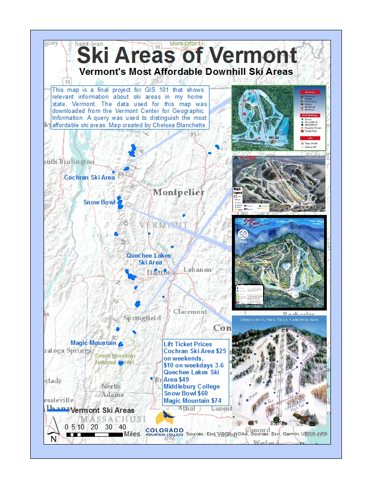
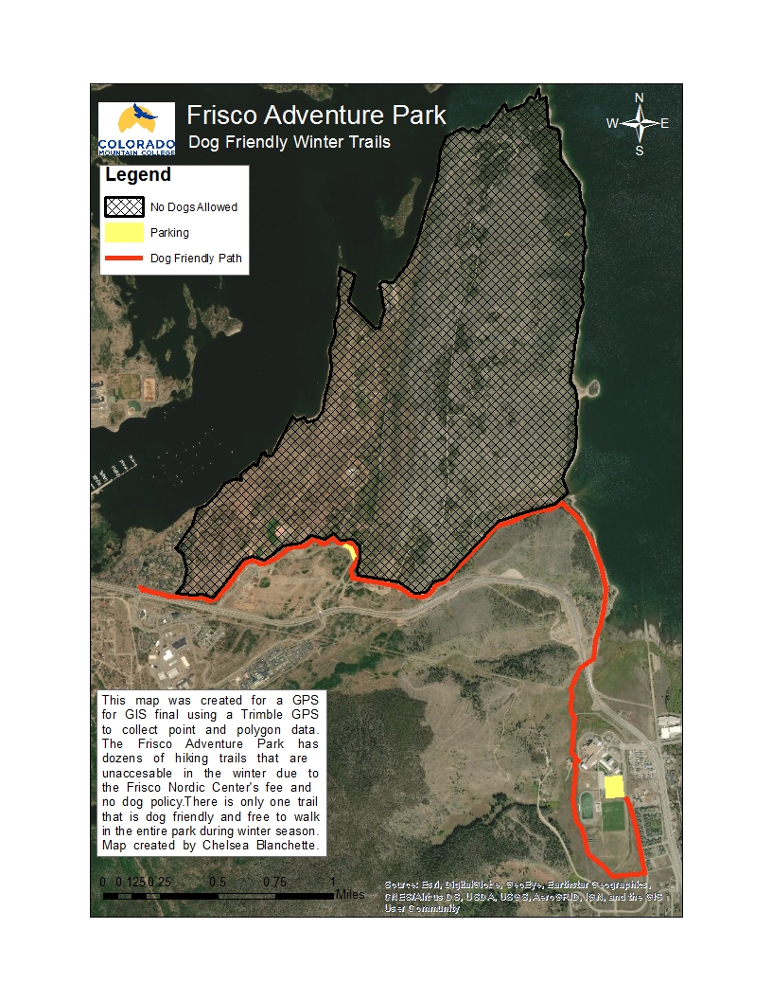

# Chelsea Blanchette's GIS Portfolio
I am a Colorado Mountain Graduate with a degree in Sustainability. I have a GIS certificate from CMC and am currently working on my advanced GIS certificate 2020 - 2021 school year. This is a collection of my GIS work I have completed at CMC. 
## Affordable Downhill Skiing in Vermont
This map depicts the most affordable downhill ski areas in Vermont. This map was created to show New Englanders where they can practice skiing at an affordable rate. 

## Dog Friendly Winter Hiking Trails Frisco, CO
This map depicts dog friendly trails accessible in the winter months in the Frisco Adventure Park trail network. These trails are limited due to the Adventure Park's cross country skiing paid access only. 

